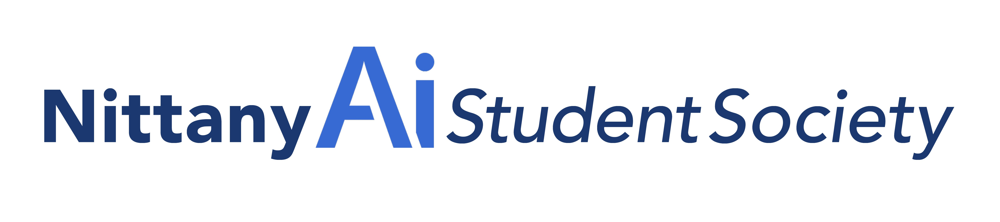

# Welcome to the Nittany AI Tech Team Repository!
 

## About This Repository

This repository is your go-to resource for everything related to AI development within the Nittany AI Studen Society. Here, we strive to share our knowledge, projects, and innovations to foster learning and collaboration. Below, you'll find a brief overview of what's available:

### 📚 Past Projects Documentation

Dive into the archives to explore detailed documentation of our past projects. These documents provide insights into our methodologies, challenges faced, and how we overcame them, serving as a valuable learning tool for both new and experienced developers.

### 📖 Wiki

Visit our wiki for an in-depth look at best practices, tutorials, and much more. It's a comprehensive guide for anyone looking to delve deeper into the world of AI.

## Contributing

We welcome contributions from everyone! Whether you're looking to correct a typo, add a project, or enhance our documentation, your input is invaluable. Please see our `CONTRIBUTING.md` for guidelines on how to contribute effectively.

## Contact Us

For any inquiries or suggestions, feel free to reach out to us at [jdp5958@psu.edu](mailto:jdp5958@psu.edu). We're always looking to improve and expand our repository with the help of our vibrant community.

Thank you for visiting our repository, and we hope you find the resources here informative and inspiring!

